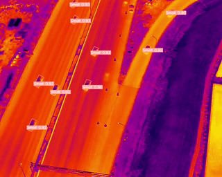
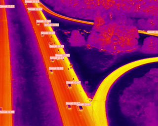
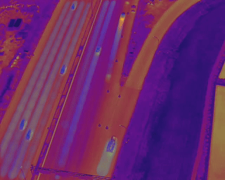
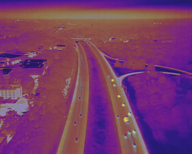
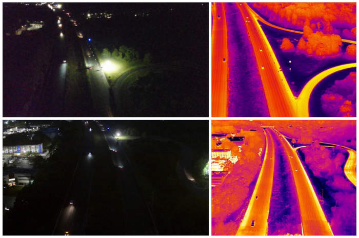
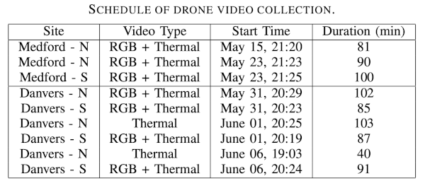
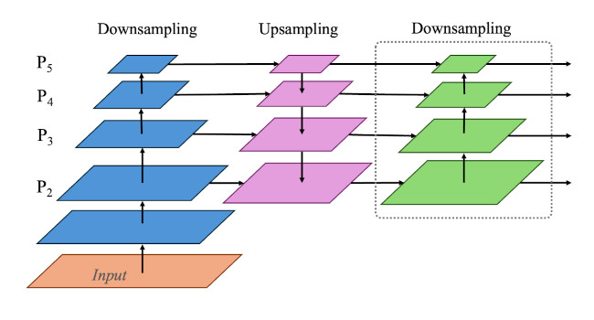
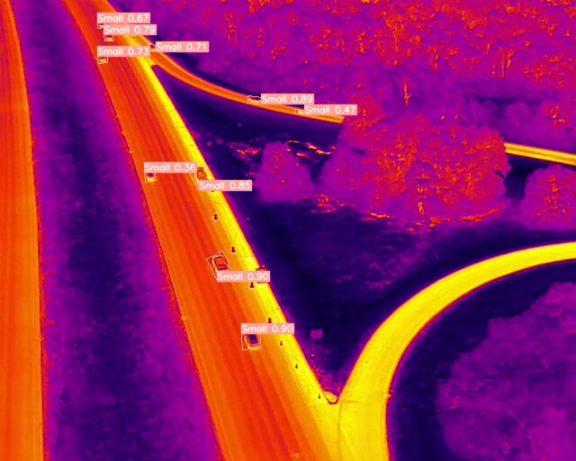
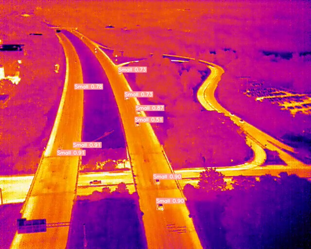
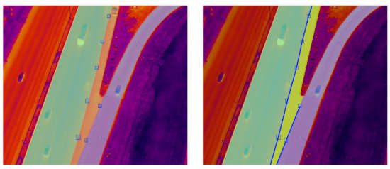

## Analyzing Highway Work Zone Traffic Dynamics via Thermal Videos and Deep Learning
#### [Zubin Bhuyan](https://cs.uml.edu/~zbhuyan/)1, Lan Wu2, [Yuanchang Xie](https://www.uml.edu/engineering/civil-environmental/faculty/xie-yuanchang.aspx)3, [Yu Cao](https://www.uml.edu/sciences/computer-science/people/cao-yu.aspx)1, and [Benyuan Liu](https://www.uml.edu/research/chords/faculty/liu-benyuan.aspx)1.

1 Miner School of Computer \& Information Sciences, University of Massachusetts Lowell, 1 University Avenue, Lowell, USA.

2 College of Automobile and Traffic Engineering, Nanjing Forestry University, China.

3 Department of Civil \& Environmental Engineering, University of Massachusetts Lowell, 1 University Avenue, Lowell, USA.

This work was supported by Massachusetts Department of Transportation

> This research is part of the [Smart Work Zone Control and Performance Evaluation Based on Trajectory Data](https://www.mass.gov/doc/smart-work-zone-control-and-performance-evaluation-based-on-trajectory-data/) project, funded by the Massachusetts Department of Transportation. For further analysis and research involving radar and ground thermal cameras, please visit the repository at: [https://github.com/z00bean/SmartWorkZoneControl](https://github.com/z00bean/SmartWorkZoneControl/).

Code review is currently in progress, and additional details and code will be provided soon.

### ThermalDrone_VehicleOBB
Repository for a thermal imaging solution aimed at vehicle tracking in drone-captured videos, incorporating oriented bounding boxes and SHAI for superior detection capabilities.

<table>
  <tr>
    <td> </td>
    <td> </td>
   </tr> 
   <tr>
      <td><i>Medford, MA: I-93, near Exit 21.</i> (https://maps.app.goo.gl/muLRTy4BFLoJyUoj7) </td>
      <td><i>Danvers, MA: I-93, near Exit 10.</i> (https://maps.app.goo.gl/j4ysifxbs8VmehxP6) </td>
  </tr>
</table>

Comparing deep learning-based methods with basic computer vision tracking, each approach has its advantages. Deep learning models offer superior accuracy and robustness in detecting and tracking vehicles but require significant computational resources and training data. On the other hand, traditional computer vision methods are less resource-intensive and can be quickly implemented but might lack the precision and adaptability of deep learning techniques, especially in complex or dynamic scenes. 

A notable challenge in processing drone video data arises during nighttime conditions, where low light and glare from headlights can significantly degrade video quality. Basic computer vision tracking methods have shown promise in analyzing thermal drone footage, especially due to the distinct features observable in top-down views. Techniques such as background subtraction, contour detection, and the use of more traditional tracking methods such as Kernelized Correlation Filter tracker, leverage the simplicity and high contrast of vehicles against the road surface. These methods are particularly effective in scenarios where deep learning models might be computationally intensive or require extensive training data. This approach, while beneficial in terms of computational efficiency and effectiveness for certain scenarios, comes with the caveat that parameter adjustments are necessary for each new location; at times, even drone movement could necessitate recalibrations, adding a layer of complexity to their application.

<table>
  <tr>
    <td> </td>
    <td> </td>
   </tr> 
   <tr>
      <td><i>Medford, MA: Heatmap, OBB + tracking. </i> </td>
      <td><i>Danvers, MA: Heatmap, OBB + Tracking. </i> </td>
  </tr>
</table>

Thermal imaging allows drones to capture images in complete darkness or through obstacles like smoke, providing a significant utility. A comparison of nighttime images taken simultaneously with regular RGB and thermal cameras from a drone illustrates this point. In the RGB images, vehicles are barely visible. However, in thermal images, objects display distinct shapes and unique thermal signatures. This difference presents a challenge, especially when objects appear small in drone-captured images, making detection and classification difficult.
<table>
  <tr>
    <td> 
      </td>
   </tr> 
   <tr>
      <td><i>RGB vs. Thermal </i> </td>
  </tr>
</table>
<table>
  <tr>
    <td> 
      </td>
   </tr> 
</table>

This research presents three key contributions:
<ol>
  <li>
Dataset: We introduce a novel thermal drone dataset designed for nighttime use. This dataset features over 13,500 instances of vehicle annotations marked with oriented bounding boxes.
    </li>
    <li>
Model: We propose an enhanced model architecture building on the YOLOv8 model to improve detection of small objects. This includes a specialized training strategy tailored for this specific application.
      </li>
      <li>
Selective SAHI: We develop a method called Selective Slicing Aided Hyper Inference (SAHI) that selectively processes image slices based on their overlap with roadway segmentation results. This approach concentrates the model's attention on the most relevant areas, enhancing the detection's efficiency and effectiveness.
        </li> </ol>
The study further illustrates how the proposed model and thermal imaging can be effectively utilized to monitor and analyze work zones under nocturnal or low-visibility conditions.

<table>
  <tr>
    <td> 
      </td>
   </tr> 
  <tr><td>PAFPN-P2</td></tr>
</table>

<table>
  
  <tr><td>Sample output- OBB detections</td></tr>
  <tr>
    <td> 
      </td>
   </tr> 
    <tr>
    <td> 
      </td>
   </tr> 
</table>

<table>
  <tr>
    <td> </td>
   </tr> 
   <tr>
      <td><i>Visualization of roadway segmentation and work zone region estimation. </td>
  </tr>
</table>

In our analysis based on drone videos at the Medford location, we closely monitored 140 vehicles as they traversed over the rumble strips. Our findings revealed that only 40 of these vehicles exhibited a speed reduction greater than 15% upon encountering the rumble strips. This indicates that the presence of rumble strips, while effective for some vehicles, does not universally lead to significant speed adjustments. Furthermore, within the context of lane changes, particularly in the second lane from the left—which also leads directly to a downstream exit ramp—only 22 vehicles (or approximately 15%) engaged in immediate lane changes within a 160-foot distance following the rumble strips. This observation underscores the complexity of interpreting vehicle behavior, as not changing lanes could also align with the intention to exit, rather than not being influenced by the rumble strips.

At the Danvers location, the analysis of trajectories for 100 vehicles revealed a consistent pattern, where a similar proportion (15%) of drivers executed immediate lane changes upon encountering rumble strips. This consistency across both locations suggests a broader trend where the presence of rumble strips influences a subset of drivers to adjust their speed or change lanes, albeit a relatively small fraction. 
